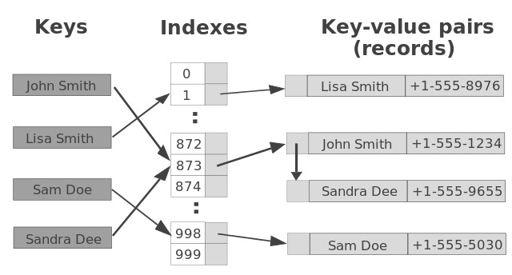

### Hash tables

A key value store. Combination of arrays and linked lists.

"foo" => "bar"
"foo1" => 1

Constant time operations for insert, delete and search.

Uses hash function to transform key to an index.

Key collisions can be an uses. Smart hashing functions minimize or eliminate collisions. 

Resizing is also used to optimize hash tables.

