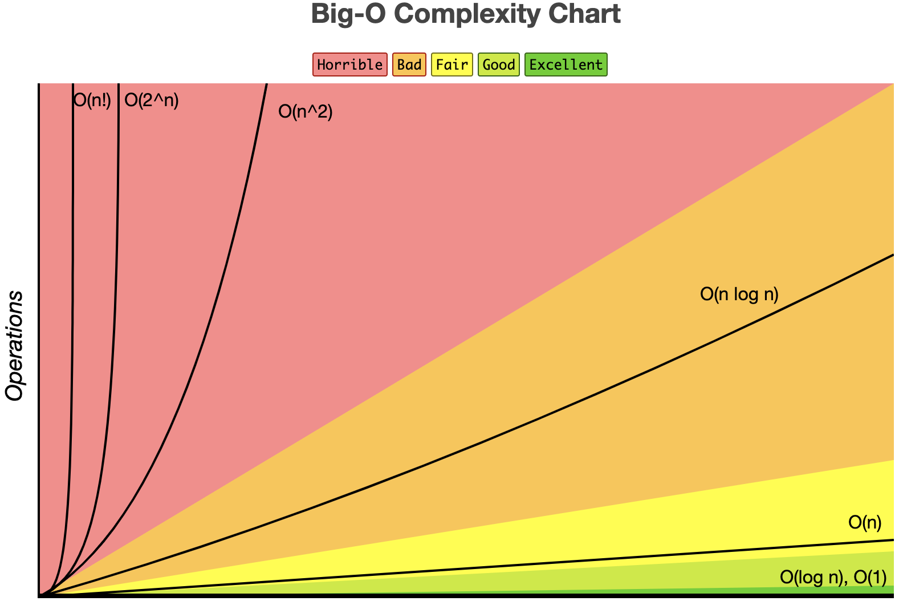
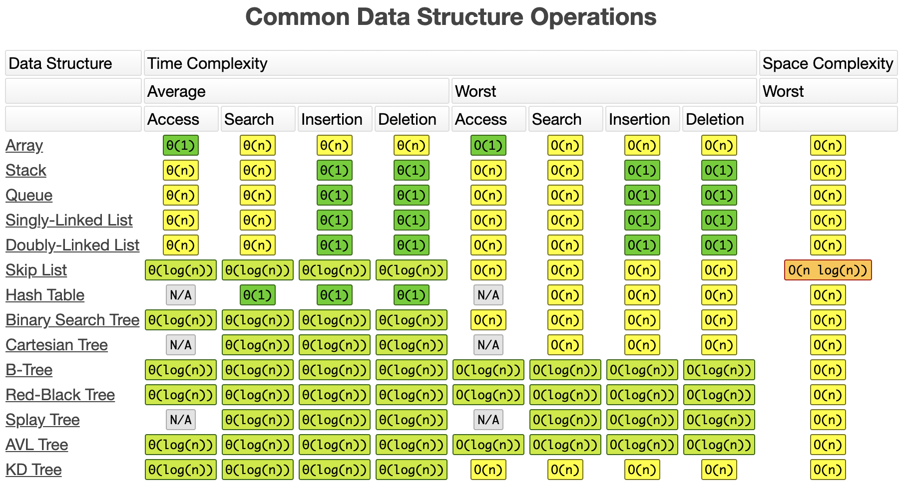

# ds-algorithms

All examples are based on Golang.

* [Go Algos book reference code](https://github.com/PacktPublishing/Learn-Data-Structures-and-Algorithms-with-Golang)
* https://www.calhoun.io/lets-learn-algorithms/
* [Algos on GitHub](https://github.com/TheAlgorithms)
* [Interview gym](https://github.com/partho-maple/coding-interview-gym)
* [Binary numbers](https://www.mathsisfun.com/binary-number-system.html)
* [Complexity analysis graph](https://www.bigocheatsheet.com/)
* [Data structures in Golang](https://github.com/procrypt/data-structures-golang)

